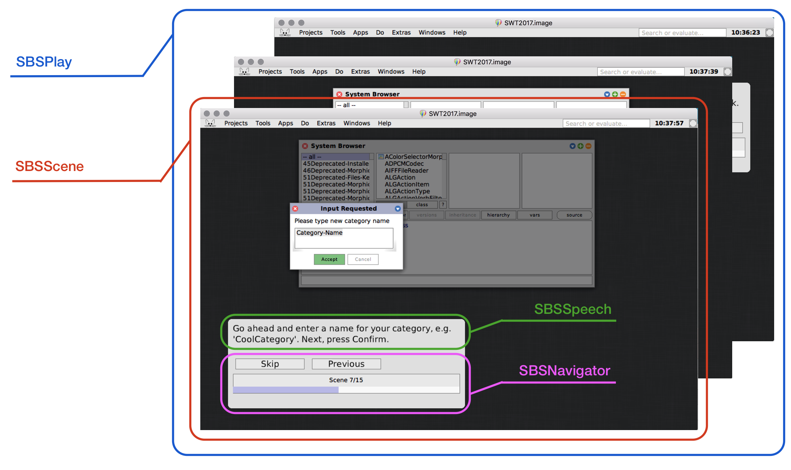

# Step-By-Step 

## Overview
A simple package, offering an API for building step-based walkthroughs and intros in Squeak.

Current features:
- text-based explanations
- highlighting morphs (also submorphs like buttons)
- automated explanation alignment
- blocking user interactions outside of highlighted morph
- progress bar
- simple navigation with previous, next or skip buttons
- limitation to one running story per world (or stage, if you want more stations in one world)

## Architecture

A play is a sequence of multiple scenes and takes place on a stage. Only on play can get shown on the single stage at the same time.
A scene, as part of the play, contains multiple speeches, which will get shown as texts to the tutorial user. Furthermore a scene can specify one morph, which will be in the spotlight of the scene. Any other morphs will become less importanter and hidden behind a half-transparent overlay. As the user should focus on the spotlight morph only, any unwanted (thus, that are outside the spotlight morph) mouse events will be filtered.
To navigate through the tutorial/ play the navigator is introduced. It can be used to move to the next/ previous scene or skip the play. A progressbar below the navigatorButtons indicates the current progress of the play.

To protect the tutorial user, against dirty code from the tutorial creator, he can press Ctrl-Space at any time, which will try to emergency exit the tutorial.
## Coding standards

Our coding standards are located in the [Wiki](https://github.com/openHPI/jenz/wiki/).
